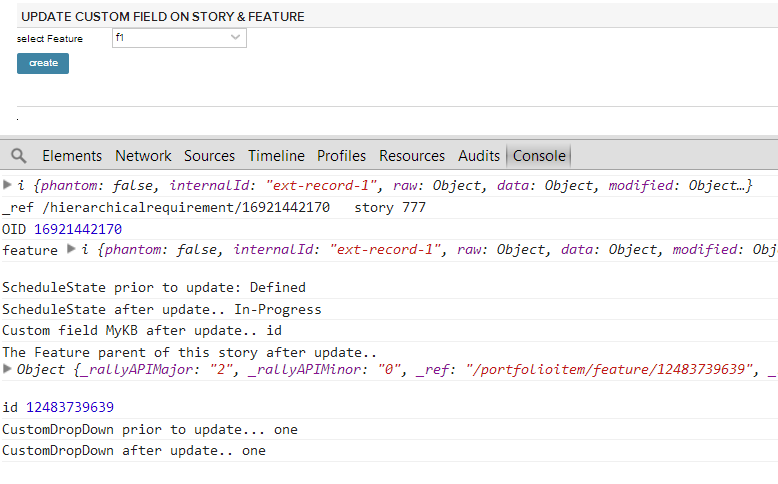

Example: create and update a story
=========================

## Overview
Select a feature from a picker, create a story and set its parent PortfilioItem/Feature to the feature selected from a picker.
Update a story's custom field and its parent feature's custom field.

## License

AppTemplate is released under the MIT license.  See the file [LICENSE](https://raw.github.com/RallyApps/AppTemplate/master/LICENSE) for the full text.
